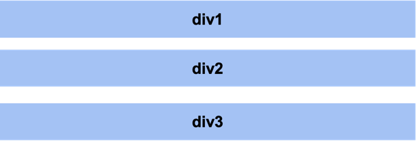
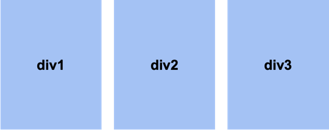
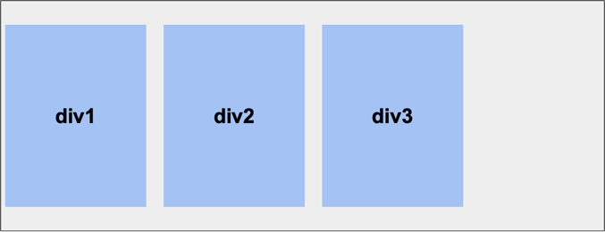
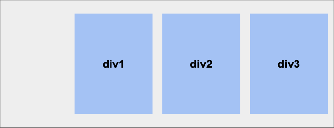
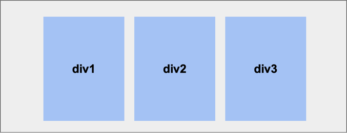
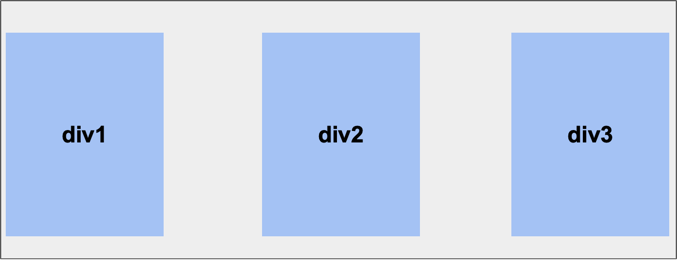
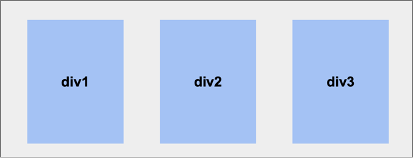

# Лекция 1

## Синтаксис HTML

HTML-разметка представляет собой набор вложенных XML-тегов, в которых содержится информация об элементах интерфейса.

Существует два вида тегов:
- **Одинарные**
```html
<singleTag/>
```
- **Парные**
```html
<pairTag>
    <childTag1>
        <childChildTag2/>
    </childTag1>
    <singleChildTag/>
</pairTag>
```

Основное отличие парных тегов от одинарных в том, что первые могут включать вложенные теги (их еще называют дочерними тегами).

Иногда нужно, чтобы в тегах содержалась какая-то дополнительная информация. Ее можно хранить в _атрибутах_, как пару ключ-значение.

```html
<pairTagWithAttrs attribute1="value1" attribute2="value2">
    <singleTagWithAttrs attribute4="value4" attribute5="value5"/>
</pairTagWithAttrs>
```

## Базовая структура HTML-файла

Итак, с синтаксисом мы разобрались. Каждый html-файл обязан имеет следующую структуру:

```html
<!DOCTYPE html>
<html lang="en">
    <head>
        <title>Заголовок страницы</title>
    </head>
    <body>
        
    </body>
</html>
```

Все начинается с `<!DOCTYPE html>`, который дает браузеру понимание, что данный файл - это HTML-файл и его надо отрендерить в окне браузера.
Далее идет корневой тег - `<html>`, который содержит в себе два основных для нас сейчас тега: `<head>` и `<body>`. 
Первый хранит в себе служебную информацию: например, кодировки, ссылки на иконки сайта хранятся тут.
Тег `<body>` же хранит весь контент сайта. 

## Основные теги для работы с текстом

Итак, самое главное на сайте - это текст. Для работы с ним умные люди разрабатывающие стандарт HTML придумали множество тегов.
Мы же ограничимся несколькими, которые нам будут нужны для нашего резюме

```html
<h1>Заголовок первого уровня</h1>
<h2>Заголовок второго уровня</h2>
<h3>Заголовок третьего уровня</h3>
<h4>Заголовок четвертого уровня</h4>
<h5>Заголовок пятого уровня</h5>
<h6>Заголовок шестого уровня</h6>

<p>
    Параграф, в котором пишется текст
</p>

<span>Текстовый контейнер</span>

<article>
    <h1>Статья</h1>
    <p>
        Данный тег <span class="some-class">используется</span>, как правило, для написания статей
    </p>
    <p>
        И может иметь много параграфов, ведь это статья, а не <b>span</b> какой-то! И span здесь будет выделен жирным шрифтом
    </p>
</article>
```

## Блоки

Иногда нам нужно выделить некоторые элементы в отдельные логические блоки, например, чтобы создать кнопку. С этим нам может помочь тег `div`.

```html
<span>Красивая кнопка:</span>

<div>
    <span>Кнопка</span>
    
</div>
```

> Если Вы вложите что-либо в div, это никак не повлияет на дизайн, если `div` не был стилизован

## Синтаксис CSS 

Таблицы стилей CSS позволяют стилизовать наш сайт.
Если HTML - это скелет, то CSS - это кожа.

Каждое CSS-правило состоит из следующих частей: селектор и набор свойств.
Селектор определяет множество элементов, к которым мы применяем набор свойств.

Каждое св-во имеет следующий синтаксис:

```css
property: "value"
```

В общем виде каждое CSS-правило выглядит так:

```css
some-selector {
    prop1: "value1";
    prop2: #AAA;
    prop3: url("https://mipt.ru");
}
```

## Про CSS-селекторы

Как уже говорилось ранее, селекторы позволяют указать браузеру на те элементы, которые мы хотим стилизовать. 
Существует несколько основных способов обращения:

* _По id._ Если мы хотим стилизовать какой-то элемент по уникальному ID, который указывается в атрибуте id элемента, тогда селектор пишем так: `#ID_ЭЛЕМЕНТА`

```css
#some-id {
    background: #FFF;
}
```

```html
<div id="some-id">
    <span>
        К моему родителю применены стили, потому что у него id = some-id
    </span>
</div>
```

* _По классу._ Если мы хотим стилизовать элементы с определенным классом, который указывается в атрибуте class элемента, тогда селектор пишем так: `.ИМЯ_КЛАССА`

```css
.some-class {
    background: linear-gradient(45deg, #3F97FF, #D138F7);
}
```

```html
<p class="some-class">
    Ко мне будут применены стили .some-class! 
</p>

<p class="some-class another-class">
    И ко мне тоже!
</p>
```

* _По тегу._ Например, если мы хотим стилизовать ссылки, то в селекторе мы не указываем ничего кроме названия тега (без точек и решеток).

```css
a {
    text-decoration: none;
}
```

```html
<div>
    <a href="https://some-site.com">
        Ко мне применены стили для ссылок, ведь я ссылка
    </a>
</div>
```

* _Для всех элементов._ Если мы хотим применить какой-то стиль для всех элементов на странице, то мы используем селектор `*`.

```css
* {
    text-decoration: underline;
}
```

```html
<p>Я подчеркнут!</p>
<span>И я подчеркнут!</span>
<a href="http://localhost:8080">И я тоже</a>
```

* _Для вложенных элементов._ 
Допустим мы хотим стилизовать все элементы, являющиеся детьми элементов, которые мы выбрали в селекторе "выше", то есть, например:
```css
.some-selector a {
    color: red;
}
```

```html
<div class="some-selector">
    <a href="http://localhost:8080">Я буду стилизована, ведь я нахожусь внутри элемента с классом some-selector</a>
</div>

<a href="http://localhost:8080">А я вот не буду, потому что я не в some-selector(</a>
```

[Подробнее про работу с тегами](https://developer.mozilla.org/ru/docs/Web/CSS/CSS_selectors)

## Работа с текстом в CSS

```css
p {
    font-family: 'Dela Gothic One', sans-serif; /* Устанавливает стиль шрифта */
    font-size: 14px; /* Устанавливает размер шрифта */
    color: #97FE87; /* Устанавливает цвет шрифта */
    font-weight: bold; /* Устанавливает жирность текста */
}
```

**Описание на Mozilla:**
- [font-family](https://developer.mozilla.org/ru/docs/Web/CSS/font-family)
- [font-size](https://developer.mozilla.org/ru/docs/Web/CSS/font-size)
- [color](https://developer.mozilla.org/ru/docs/Web/CSS/color)
- [font-weight](https://developer.mozilla.org/ru/docs/Web/CSS/font-weight)

## Флексбоксы

Иногда на нужно центрировать элементы как-нибудь по-особому. С этим нам помогают flex-боксы.
Самое главное, чтобы использовать flex-боксы, необходимо прописать св-во `display` со значением `flex`. 

```css
.some-block {
    /* ... */
    display: flex;
    /* ... */
}
```

### `flex-direction`

Св-во `flex-direction` задает направление главной оси выравнивания.

Существует несколько основных значений этого св-ва:

- `column`



- `row`



### `justify-content` и `align-items`

Св-ва `justify-content` и `align-items` задают выравнивание вдоль главной оси и перпендикулярной к ней соответственно.

Разберем как каждое значение данного св-ва влияет на положение элементов:

- `flex-start`


- `flex-end`


- `center`


- `space-between`


- `space-around`

